# PHASE 1: Infrastructure & Core Network Deployment (VM-Based)

**⏱️ Duration: 5-6 Hours | 🎯 Goal: Complete 4G and 5G core network on GCP VMs**

---

## 📋 Phase 1 Overview

In this phase, you will:

1. Set up GCP project with custom VPC and security rules
2. Provision 5 Virtual Machines for different network functions
3. Install and configure MongoDB 8.0 database
4. Deploy complete 4G EPC network (MME, HSS, PCRF, SGW, PGW)
5. Deploy complete 5G SA Core network (AMF, SMF, UPF, NRF, UDM, PCF, AUSF, NSSF)
6. Configure networking (SCTP bindings, GTP-U, NAT rules)
7. Deploy WebUI for subscriber management

**Result:** Fully functional 4G and 5G core networks ready for testing

---

## ✅ Prerequisites Verification

Before starting, verify you have:

```bash
# Check Google Cloud SDK
gcloud --version
# Expected: Google Cloud SDK 450.0.0+

# Check authentication
gcloud auth list
# Expected: Your email marked as ACTIVE

# Verify local tools
python3 --version    # >= 3.10
git --version        # Any recent version
```

---

## 🔧 STEP 1: GCP Project Setup (30 minutes)

### 1.1 Authenticate and Set Project

```bash
# Login to Google Cloud
gcloud auth login

# Create new project (or use existing)
export PROJECT_ID="telecom5g-prod2"  # Change to your project ID
gcloud projects create $PROJECT_ID --name="DevOps 5G 4G Migration"

# Set as active project
gcloud config set project $PROJECT_ID

# Link billing account
BILLING_ACCOUNT=$(gcloud billing accounts list --format="value(ACCOUNT_ID)" | head -n 1)
gcloud billing projects link $PROJECT_ID --billing-account=$BILLING_ACCOUNT

# Verify project is set
gcloud config get-value project
```

### 1.2 Enable Required APIs

```bash
# Enable all necessary GCP APIs
gcloud services enable compute.googleapis.com \
  servicenetworking.googleapis.com \
  cloudresourcemanager.googleapis.com \
  oslogin.googleapis.com \
  logging.googleapis.com \
  monitoring.googleapis.com

# Verify APIs are enabled
gcloud services list --enabled | grep -E "servicenetworking.googleapis.com"
```

### 1.3 Set Default Region and Zone

```bash
# Set region and zone (choose closest to your location)
export REGION="us-central1"
export ZONE="us-central1-a"

gcloud config set compute/region $REGION
gcloud config set compute/zone $ZONE

echo "✅ GCP project configured: $PROJECT_ID in $REGION"
```

---

## 🌐 STEP 2: Network Infrastructure (45 minutes)

### 2.1 Create Custom VPC

```bash
# Create custom VPC network
gcloud compute networks create open5gs-vpc \
  --subnet-mode=custom \
  --bgp-routing-mode=regional \
  --description="Open5GS Core Network VPC"

echo "✅ VPC created: open5gs-vpc"
```

### 2.2 Create Subnets

```bash
# Control Plane Subnet (for MME, AMF, SMF, NRF, DB)
gcloud compute networks subnets create control-subnet \
  --network=open5gs-vpc \
  --region=$REGION \
  --range=10.10.0.0/24 \
  --description="Control Plane and Signaling"

# User Plane Subnet (for UPF, SGW-U)
gcloud compute networks subnets create data-subnet \
  --network=open5gs-vpc \
  --region=$REGION \
  --range=10.11.0.0/24 \
  --description="User Plane Data Traffic"

# Verify subnets
gcloud compute networks subnets list --network=open5gs-vpc
```

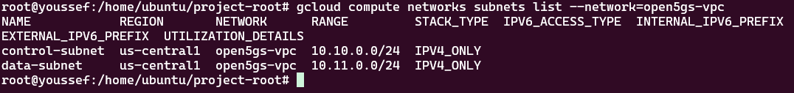

### 2.3 Configure Firewall Rules

```bash
# Allow SSH from anywhere (restrict in production)
gcloud compute firewall-rules create open5gs-allow-ssh \
  --network=open5gs-vpc \
  --allow=tcp:22 \
  --source-ranges=0.0.0.0/0 \
  --description="Allow SSH access"

# Allow SCTP for S1-MME (4G) and NGAP (5G)
gcloud compute firewall-rules create open5gs-allow-sctp \
  --network=open5gs-vpc \
  --allow=sctp:36412,sctp:38412 \
  --source-ranges=10.10.0.0/24,10.11.0.0/24 \
  --description="Allow SCTP for MME and AMF"

# Allow GTP-U for user plane traffic
gcloud compute firewall-rules create open5gs-allow-gtpu \
  --network=open5gs-vpc \
  --allow=udp:2152 \
  --source-ranges=10.10.0.0/24,10.11.0.0/24 \
  --description="Allow GTP-U for UPF and SGW"

# Allow HTTP/2 for 5G SBI (Service Based Interface)
gcloud compute firewall-rules create open5gs-allow-sbi \
  --network=open5gs-vpc \
  --allow=tcp:7777 \
  --source-ranges=10.10.0.0/24 \
  --description="Allow HTTP/2 SBI communication"

# Allow Diameter for 4G (S6a, Gx interfaces)
gcloud compute firewall-rules create open5gs-allow-diameter \
  --network=open5gs-vpc \
  --allow=tcp:3868,sctp:3868 \
  --source-ranges=10.10.0.0/24 \
  --description="Allow Diameter protocol"

# Allow WebUI access (port 9998 - socat forwards to WebUI on 9999)
gcloud compute firewall-rules create open5gs-allow-webui \
  --network=open5gs-vpc \
  --allow=tcp:9998 \
  --source-ranges=0.0.0.0/0 \
  --description="Allow Open5GS WebUI access on port 9998"

# Allow MongoDB
gcloud compute firewall-rules create open5gs-allow-mongodb \
  --network=open5gs-vpc \
  --allow=tcp:27017 \
  --source-ranges=10.10.0.0/24 \
  --description="Allow MongoDB access"

# Allow Prometheus/Grafana
gcloud compute firewall-rules create open5gs-allow-monitoring \
  --network=open5gs-vpc \
  --allow=tcp:9090,tcp:3000 \
  --source-ranges=0.0.0.0/0 \
  --description="Allow monitoring access"

# Allow internal communication
gcloud compute firewall-rules create open5gs-allow-internal \
  --network=open5gs-vpc \
  --allow=tcp,udp,icmp \
  --source-ranges=10.10.0.0/24,10.11.0.0/24 \
  --description="Allow all internal communication"

# List all firewall rules
gcloud compute firewall-rules list --filter="network:open5gs-vpc"

echo "✅ Firewall rules configured"

```

## 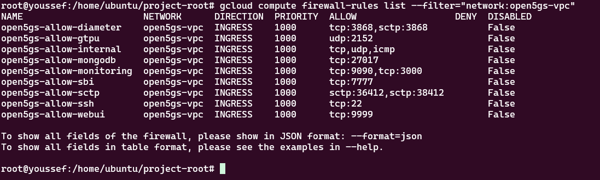

### 2.4 Configure Cloud NAT (Required for VMs without External IP)

**Why Cloud NAT?** VMs without external IPs cannot access the internet (to download packages, updates, etc.) without Cloud NAT.

```bash
# Create Cloud Router (required for NAT)
gcloud compute routers create open5gs-router \
  --network=open5gs-vpc \
  --region=$REGION

# Create Cloud NAT configuration
gcloud compute routers nats create open5gs-nat \
  --router=open5gs-router \
  --region=$REGION \
  --nat-all-subnet-ip-ranges \
  --auto-allocate-nat-external-ips

# Verify NAT configuration
gcloud compute routers nats list --router=open5gs-router --region=$REGION

echo "✅ Cloud NAT configured - internal VMs can now access internet"
```

---

## 💻 STEP 3: Virtual Machine Provisioning (30 minutes)

### 3.1 Create Database VM

```bash
# MongoDB Database VM (no external IP - saves quota)
# Using e2-small for CPU quota efficiency
gcloud compute instances create open5gs-db \
  --zone=$ZONE \
  --machine-type=e2-small \
  --subnet=control-subnet \
  --private-network-ip=10.10.0.4 \
  --no-address \
  --image-family=ubuntu-2204-lts \
  --image-project=ubuntu-os-cloud \
  --boot-disk-size=20GB \
  --boot-disk-type=pd-standard \
  --tags=database,open5gs

echo "✅ Database VM created: open5gs-db (10.10.0.4 - internal only, 2 CPUs)"
```

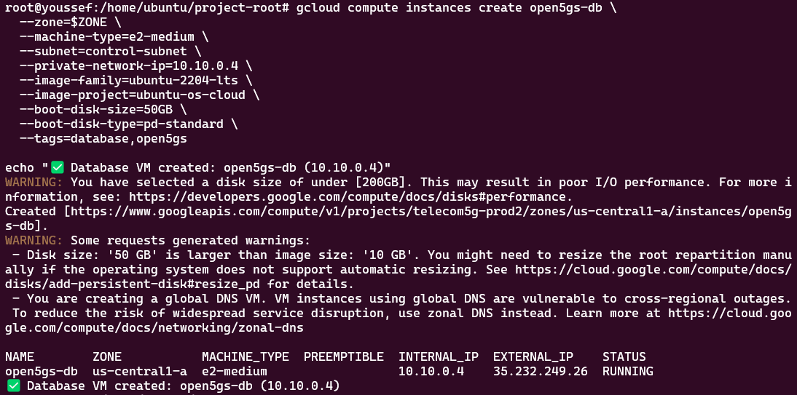

### 3.2 Create Control Plane VM

```bash
# Control Plane VM (MME, AMF, SMF, NRF, HSS, UDM, PCF, AUSF, PCRF)
# HAS external IP - acts as bastion host for SSH access
# Using e2-standard-2 for CPU quota efficiency
gcloud compute instances create open5gs-control \
  --zone=$ZONE \
  --machine-type=e2-standard-2 \
  --subnet=control-subnet \
  --private-network-ip=10.10.0.2 \
  --image-family=ubuntu-2204-lts \
  --image-project=ubuntu-os-cloud \
  --boot-disk-size=30GB \
  --boot-disk-type=pd-standard \
  --tags=control-plane,open5gs

echo "✅ Control Plane VM created: open5gs-control (10.10.0.2 + external IP, 2 CPUs)"
```

### 3.3 Create User Plane VM

```bash
# User Plane VM (UPF, SGW-U, PGW-U) - no external IP
# Using e2-standard-2 for CPU quota efficiency (free tier limit)
gcloud compute instances create open5gs-userplane \
  --zone=$ZONE \
  --machine-type=e2-standard-2 \
  --subnet=data-subnet \
  --private-network-ip=10.11.0.7 \
  --no-address \
  --image-family=ubuntu-2204-lts \
  --image-project=ubuntu-os-cloud \
  --boot-disk-size=30GB \
  --boot-disk-type=pd-standard \
  --tags=user-plane,open5gs \
  --can-ip-forward

echo "✅ User Plane VM created: open5gs-userplane (10.11.0.7 - internal only, 2 CPUs)"
```

### 3.4 Create Monitoring VM

```bash
# Monitoring VM (Prometheus, Grafana, WebUI)
# HAS external IP - required for WebUI/Grafana access
# Using e2-small for CPU quota efficiency
gcloud compute instances create open5gs-monitoring \
  --zone=$ZONE \
  --machine-type=e2-small \
  --subnet=control-subnet \
  --private-network-ip=10.10.0.50 \
  --image-family=ubuntu-2204-lts \
  --image-project=ubuntu-os-cloud \
  --boot-disk-size=20GB \
  --boot-disk-type=pd-standard \
  --tags=monitoring,open5gs

echo "✅ Monitoring VM created: open5gs-monitoring (10.10.0.50 + external IP, 2 CPUs)"
```

### 3.5 Create RAN Simulator VM

```bash
# RAN Simulator VM (UERANSIM - eNB, gNB, UEs) - no external IP
# Using e2-small for CPU quota efficiency
gcloud compute instances create open5gs-ran \
  --zone=$ZONE \
  --machine-type=e2-small \
  --subnet=control-subnet \
  --private-network-ip=10.10.0.100 \
  --no-address \
  --image-family=ubuntu-2204-lts \
  --image-project=ubuntu-os-cloud \
  --boot-disk-size=20GB \
  --boot-disk-type=pd-standard \
  --tags=ran-simulator,open5gs

echo "✅ RAN Simulator VM created: open5gs-ran (10.10.0.100 - internal only, 2 CPUs)"
```

### 3.6 Verify All VMs

```bash
# List all instances
gcloud compute instances list --filter="name~open5gs"

# Expected output (only 2 with external IPs, all 2 CPUs each = 10 total):
# NAME                  ZONE           MACHINE_TYPE   INTERNAL_IP   EXTERNAL_IP    STATUS
# open5gs-db            us-central1-a  e2-small       10.10.0.4     -              RUNNING
# open5gs-control       us-central1-a  e2-standard-2  10.10.0.2     x.x.x.x        RUNNING
# open5gs-userplane     us-central1-a  e2-standard-2  10.11.0.7     -              RUNNING
# open5gs-monitoring    us-central1-a  e2-small       10.10.0.50    x.x.x.x        RUNNING
# open5gs-ran           us-central1-a  e2-small       10.10.0.100   -              RUNNING
```

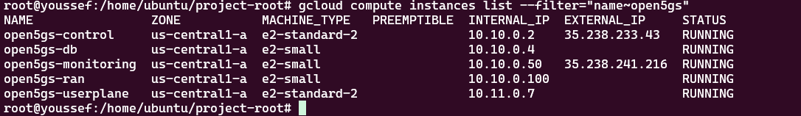

### 3.7 SSH Access to Internal VMs

**VMs with external IP** (direct access):

```bash
gcloud compute ssh open5gs-control --zone=$ZONE
# just click enter
gcloud compute ssh open5gs-monitoring --zone=$ZONE
# just click enter
```

**VMs without external IP** (2 options):

**Option A: IAP Tunneling (Recommended - from your local machine)**

```bash
# Enable IAP API first (only once)
gcloud services enable iap.googleapis.com

# Database VM
gcloud compute ssh open5gs-db --zone=$ZONE --tunnel-through-iap

# User Plane VM
gcloud compute ssh open5gs-userplane --zone=$ZONE --tunnel-through-iap

# RAN Simulator VM
gcloud compute ssh open5gs-ran --zone=$ZONE --tunnel-through-iap
```

**Option B: SSH through Control VM as bastion (if IAP doesn't work)**

```bash
# Step 1: SSH into Control VM first (from your local machine)
gcloud compute ssh open5gs-control --zone=$ZONE

# Step 2: From inside Control VM, install gcloud if needed (first time only)
# Check if gcloud exists
which gcloud
# If not found, install it:
curl https://sdk.cloud.google.com | bash
exec -l $SHELL
gcloud init

# Step 3: From Control VM, SSH to internal VMs using gcloud
gcloud compute ssh open5gs-db --zone=us-central1-a --internal-ip
gcloud compute ssh open5gs-userplane --zone=us-central1-a --internal-ip
gcloud compute ssh open5gs-ran --zone=us-central1-a --internal-ip
```

**Note:** Direct `ssh 10.10.0.4` won't work without manual SSH key setup. Always use `gcloud compute ssh` commands.

---

## 🗄️ STEP 4: MongoDB Database Setup (20 minutes)

**Reference:** [Open5GS Docs - MongoDB Installation](https://open5gs.org/open5gs/docs/guide/01-quickstart/)

### 4.1 SSH into Database VM

```bash
# SSH into database VM (use IAP tunneling from local machine)
gcloud compute ssh open5gs-db --zone=$ZONE --tunnel-through-iap
```

### 4.2 Install MongoDB 8.0

```bash
# Update system
sudo apt update && sudo apt upgrade -y

# Install prerequisites
sudo apt install -y gnupg curl

# Import MongoDB GPG key
curl -fsSL https://www.mongodb.org/static/pgp/server-8.0.asc | \
  sudo gpg -o /usr/share/keyrings/mongodb-server-8.0.gpg --dearmor

# Add MongoDB repository
echo "deb [ arch=amd64,arm64 signed-by=/usr/share/keyrings/mongodb-server-8.0.gpg ] https://repo.mongodb.org/apt/ubuntu jammy/mongodb-org/8.0 multiverse" | \
  sudo tee /etc/apt/sources.list.d/mongodb-org-8.0.list

# Update package list
sudo apt update

# Install MongoDB
sudo apt install -y mongodb-org

# Verify installation
mongod --version
```

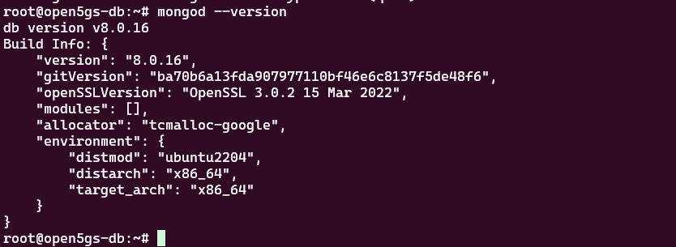

### 4.3 Configure MongoDB for Remote Access

```bash
# Backup original configuration
sudo cp /etc/mongod.conf /etc/mongod.conf.backup

# Edit MongoDB configuration
sudo nano /etc/mongod.conf
```

**Change the `bindIp` setting:**

```yaml
# network interfaces
net:
  port: 27017
  bindIp: 0.0.0.0 # Change from 127.0.0.1 to allow remote connections
```

**Save and exit** (Ctrl+O, Enter, Ctrl+X)

### 4.4 Start MongoDB Service

```bash
# Enable MongoDB to start on boot
sudo systemctl enable mongod

# Start MongoDB service
sudo systemctl start mongod

# Check status
sudo systemctl status mongod

# Verify MongoDB is listening
sudo ss -tlnp | grep 27017

# Test local connection
mongosh --eval "db.adminCommand('ping')"

echo "✅ MongoDB 8.0 installed and configured"
```

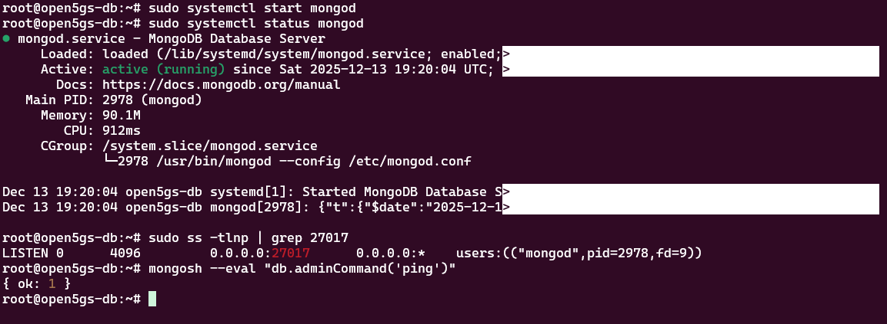

### 4.5 Exit Database VM

```bash
exit
```

---

## 📡 STEP 5: Open5GS Installation & Configuration (60 minutes)

**Reference:** [Open5GS Docs - Installation](https://open5gs.org/open5gs/docs/guide/01-quickstart/)

### 5.1 SSH into Control Plane VM

```bash
gcloud compute ssh open5gs-control --zone=$ZONE
```

### 5.2 Install Open5GS

```bash
# Update system
sudo apt update && sudo apt upgrade -y

# Add MongoDB repository (for client libraries only - to satisfy Open5GS dependencies)
sudo apt install -y gnupg curl
curl -fsSL https://www.mongodb.org/static/pgp/server-8.0.asc | \
  sudo gpg -o /usr/share/keyrings/mongodb-server-8.0.gpg --dearmor
echo "deb [ arch=amd64,arm64 signed-by=/usr/share/keyrings/mongodb-server-8.0.gpg ] https://repo.mongodb.org/apt/ubuntu jammy/mongodb-org/8.0 multiverse" | \
  sudo tee /etc/apt/sources.list.d/mongodb-org-8.0.list
sudo apt update

# Install MongoDB client tools (NOT the server - that's on the DB VM)
sudo apt install -y mongodb-mongosh

# Add Open5GS PPA repository
sudo add-apt-repository -y ppa:open5gs/latest
sudo apt update

# Install Open5GS (installs all components)
sudo apt install -y open5gs

# Verify installation
dpkg -l | grep open5gs

echo "✅ Open5GS installed"
```

### 5.3 QUICK CONFIG - All Changes in One Script (RECOMMENDED)

**For a faster setup, run this single script that applies ALL required changes:**

```bash
# Apply all configuration changes with one script
cat > ~/configure-open5gs.sh << 'SCRIPT'
#!/bin/bash
echo "Configuring Open5GS for multi-VM deployment..."

# Control Plane configs (this VM = 10.10.0.2)
# User Plane VM = 10.11.0.7
# Database VM = 10.10.0.4

# CRITICAL FIX 1: UDR - Change MongoDB URI to remote database
sudo sed -i 's|mongodb://127.0.0.1/open5gs|mongodb://10.10.0.4/open5gs|g' /etc/open5gs/udr.yaml

# CRITICAL FIX 2: PCF - Change MongoDB URI to remote database
sudo sed -i 's|db_uri: mongodb://localhost/open5gs|db_uri: mongodb://10.10.0.4/open5gs|g' /etc/open5gs/pcf.yaml

# CRITICAL FIX 3: SMF - Fix network binding addresses
# Keep SBI on localhost for internal communication, but use 10.10.0.2 for PFCP/GTP
sudo sed -i '/sbi:/,/port: 7777/{s/address: 127.0.0.4/address: 127.0.0.4/}' /etc/open5gs/smf.yaml
sudo sed -i 's/address: 127.0.0.4/address: 10.10.0.2/g' /etc/open5gs/smf.yaml
# Restore SBI to localhost (the above changed all, now fix SBI back)
sudo sed -i '/^smf:/,/^  sbi:/{:a;n;/^    server:/,/^      - address:/{s/address: 10.10.0.2/address: 127.0.0.4/;ba}}' /etc/open5gs/smf.yaml

# Standard configs
# 4G MME - change S1AP address
sudo sed -i 's/127.0.0.2/10.10.0.2/g' /etc/open5gs/mme.yaml

# 4G SGW-C - point to User Plane VM for SGW-U
sudo sed -i 's/127.0.0.6/10.11.0.7/g' /etc/open5gs/sgwc.yaml

# SMF - point to User Plane VM for UPF
sudo sed -i 's/127.0.0.7/10.11.0.7/g' /etc/open5gs/smf.yaml

# 5G AMF - change NGAP address
sudo sed -i 's/127.0.0.5/10.10.0.2/g' /etc/open5gs/amf.yaml

# Other MongoDB connections - point to Database VM
for file in hss.yaml pcrf.yaml bsf.yaml; do
  sudo sed -i 's/127.0.0.1\/open5gs/10.10.0.4\/open5gs/g' /etc/open5gs/$file
done

echo "✅ All configurations updated!"
echo "Now disabling 4G services (we're running 5G SA only)..."

# CRITICAL FIX 4: Disable 4G services to avoid port conflicts with 5G
sudo systemctl stop open5gs-mmed open5gs-hssd open5gs-pcrfd open5gs-sgwcd
sudo systemctl disable open5gs-mmed open5gs-hssd open5gs-pcrfd open5gs-sgwcd

echo "Now restarting 5G services..."

# Restart 5G services
sudo systemctl restart open5gs-nrfd
sleep 3
sudo systemctl restart open5gs-smfd open5gs-amfd open5gs-udmd open5gs-udrd open5gs-pcfd open5gs-ausfd open5gs-nssfd open5gs-bsfd

# Enable 5G services on boot
sudo systemctl enable open5gs-nrfd open5gs-smfd open5gs-amfd open5gs-udmd open5gs-udrd open5gs-pcfd open5gs-ausfd open5gs-nssfd open5gs-bsfd

echo "✅ All 5G services configured and restarted!"
SCRIPT

chmod +x ~/configure-open5gs.sh
~/configure-open5gs.sh
```

### 5.4 Verify Services Are Running

```bash
# Check 5G core services (4G services are disabled)
echo "=== 5G Control Plane Services ==="
for svc in smfd nrfd amfd udmd udrd pcfd ausfd nssfd bsfd; do
  status=$(systemctl is-active open5gs-$svc)
  echo "open5gs-$svc: $status"
done

# Verify key ports are listening
echo ""
echo "=== Port Verification ==="
sudo ss -tlnp | grep -E "36412|38412|7777"
```

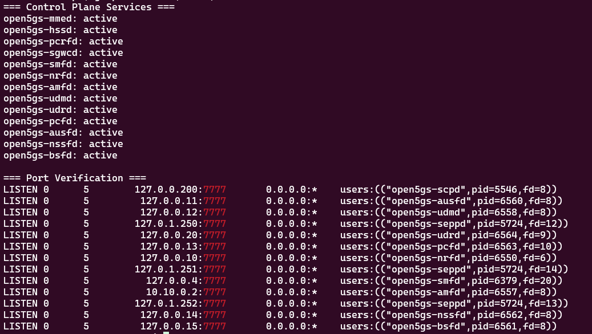

### 5.5 Exit Control Plane VM

```bash
exit
```

---

## 📊 STEP 6: User Plane Configuration (30 minutes)

### 6.1 SSH into User Plane VM

```bash
# SSH into User Plane VM (use IAP tunneling from local machine)
gcloud compute ssh open5gs-userplane --zone=$ZONE --tunnel-through-iap
```

### 6.2 Install Open5GS on User Plane VM

```bash
# Update system
sudo apt update && sudo apt upgrade -y

# Add MongoDB repository (for client libraries only - to satisfy Open5GS dependencies)
sudo apt install -y gnupg curl
curl -fsSL https://www.mongodb.org/static/pgp/server-8.0.asc | \
  sudo gpg -o /usr/share/keyrings/mongodb-server-8.0.gpg --dearmor
echo "deb [ arch=amd64,arm64 signed-by=/usr/share/keyrings/mongodb-server-8.0.gpg ] https://repo.mongodb.org/apt/ubuntu jammy/mongodb-org/8.0 multiverse" | \
  sudo tee /etc/apt/sources.list.d/mongodb-org-8.0.list
sudo apt update

# Install MongoDB client tools (NOT the server)
sudo apt install -y mongodb-mongosh

# Add Open5GS PPA repository
sudo add-apt-repository -y ppa:open5gs/latest
sudo apt update

# Install Open5GS (only need UPF and SGW-U components)
sudo apt install -y open5gs

echo "✅ Open5GS installed on User Plane VM"
```

### 6.3 Configure User Plane (Quick Script)

```bash
# Apply all User Plane configuration with one script
cat > ~/configure-userplane.sh << 'SCRIPT'
#!/bin/bash
echo "Configuring User Plane for multi-VM deployment..."

# This VM = 10.11.0.7

# CRITICAL FIX: Disable 4G services to avoid port conflicts (SGW-U uses same port as UPF)
echo "Stopping 4G services that conflict with 5G..."
sudo systemctl stop open5gs-sgwud open5gs-sgwcd open5gs-smfd
sudo systemctl disable open5gs-sgwud open5gs-sgwcd open5gs-smfd

# UPF - change GTP-U address (5G User Plane)
sudo sed -i 's/127.0.0.7/10.11.0.7/g' /etc/open5gs/upf.yaml

# Enable IP forwarding
sudo sysctl -w net.ipv4.ip_forward=1
echo 'net.ipv4.ip_forward=1' | sudo tee -a /etc/sysctl.conf
sudo sysctl -p

# Configure NAT for UE traffic
sudo iptables -t nat -A POSTROUTING -s 10.45.0.0/16 ! -o ogstun -j MASQUERADE
sudo iptables -t nat -A POSTROUTING -s 10.46.0.0/16 ! -o ogstun -j MASQUERADE
sudo iptables -I INPUT -i ogstun -j ACCEPT
sudo iptables -I FORWARD -i ogstun -j ACCEPT
sudo iptables -I FORWARD -o ogstun -j ACCEPT

# Save iptables
sudo apt install -y iptables-persistent
sudo netfilter-persistent save

# Restart and enable 5G UPF service only
sudo systemctl restart open5gs-upfd
sudo systemctl enable open5gs-upfd

echo "✅ User Plane configured for 5G!"
SCRIPT

chmod +x ~/configure-userplane.sh
~/configure-userplane.sh
```

### 6.4 Verify User Plane Services

```bash
# Check services (only UPF for 5G)
echo "=== User Plane Services ==="
sudo systemctl status open5gs-upfd --no-pager

# Verify UPF is listening on correct ports
sudo ss -ulnp | grep 8805  # PFCP port
sudo ss -ulnp | grep 2152  # GTP-U port

# Verify iptables rules
sudo iptables -t nat -L POSTROUTING -n -v | grep 10.45
sudo systemctl status open5gs-upfd --no-pager
sudo systemctl status open5gs-sgwud --no-pager

# Verify GTP-U port 2152 is listening
sudo ss -ulnp | grep 2152
# Check ogstun interface is created
ip addr show ogstun

echo "✅ User Plane ready"
```

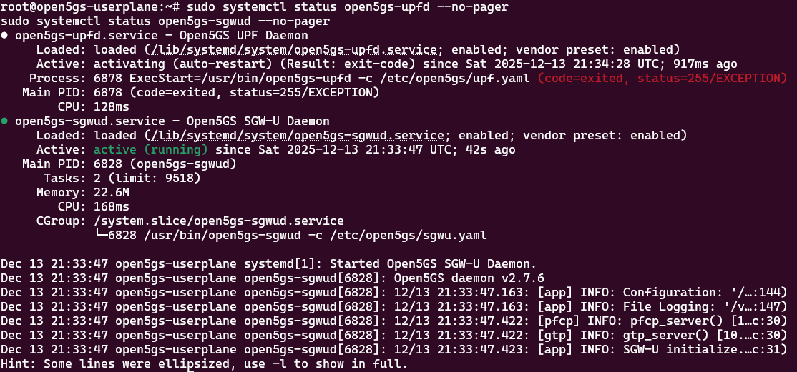

### 6.5 Exit User Plane VM

```bash
exit
```

---

## 🌐 STEP 7: WebUI Deployment (30 minutes)

**Reference:** [Open5GS Docs - WebUI](https://open5gs.org/open5gs/docs/guide/01-quickstart/)

### 7.1 SSH into Monitoring VM

```bash
# SSH into Monitoring VM (has external IP)
gcloud compute ssh open5gs-monitoring --zone=$ZONE
```

### 7.2 Install Node.js and WebUI

**Important Notes:**

- WebUI installation requires `open5gs-common` package to create the `open5gs` user
- WebUI script checks for `mongodb-org` package even when using remote DB
- Use `|| true` to ignore the mongo-init error (it tries to connect to localhost instead of remote DB)
- Admin account must be created manually in remote MongoDB at 10.10.0.4

```bash
# Update system and install Node.js 20.x
sudo apt update && sudo apt upgrade -y
curl -fsSL https://deb.nodesource.com/setup_20.x | sudo -E bash -
sudo apt install -y nodejs

# Add Open5GS repository (to create open5gs user required by WebUI)
sudo add-apt-repository -y ppa:open5gs/latest
sudo apt update

# Install minimal Open5GS packages to create the open5gs user
# (WebUI chown requires this user to exist)
sudo apt install -y open5gs-common

# Add MongoDB repository (required by WebUI installation script)
sudo apt install -y gnupg curl
curl -fsSL https://www.mongodb.org/static/pgp/server-8.0.asc | \
  sudo gpg -o /usr/share/keyrings/mongodb-server-8.0.gpg --dearmor
echo "deb [ arch=amd64,arm64 signed-by=/usr/share/keyrings/mongodb-server-8.0.gpg ] https://repo.mongodb.org/apt/ubuntu jammy/mongodb-org/8.0 multiverse" | \
  sudo tee /etc/apt/sources.list.d/mongodb-org-8.0.list
sudo apt update

# Install MongoDB packages (WebUI script checks for these)
sudo apt install -y mongodb-org

# Disable MongoDB service (we use remote DB at 10.10.0.4, not local)
sudo systemctl stop mongod
sudo systemctl disable mongod

# Install WebUI (ignore the mongo-init error at the end)
curl -fsSL https://open5gs.org/open5gs/assets/webui/install | sudo -E bash - || true

# Configure MongoDB connection to remote DB
echo "DB_URI=mongodb://10.10.0.4/open5gs" | sudo tee /etc/default/open5gs-webui

# Create default admin account in REMOTE MongoDB
mongosh --host 10.10.0.4 --eval "
  db = db.getSiblingDB('open5gs');
  db.accounts.deleteMany({});
  db.accounts.insertOne({
    salt: 'f5c15fa72622d62b6b790aa8569b9339729801ab8bda5d13997b5db6bfc1d997',
    hash: '402223057db5194899d2e082aeb0e5ec4ac3c33f9db45cf2f8f27e1f4a7d391563f91db83b0b2c3c2ed69ff3d9d2c9eb077355b3fcefcb06a2926972e27d3c67',
    username: 'admin',
    roles: [ 'admin' ],
    __v: 0
  });
  print('✅ Admin account created: admin / 1423');
"

# Start WebUI
sudo systemctl restart open5gs-webui
sudo systemctl enable open5gs-webui

# Verify WebUI is running
sudo systemctl status open5gs-webui --no-pager

# Get access URL
EXTERNAL_IP=$(curl -s ifconfig.me)
echo ""
echo "✅ WebUI installed and running!"
echo "Note: WebUI listens on 127.0.0.1:9999 by default"
echo "You'll configure port forwarding in the next step to access it externally"
```

### 7.3 Exit Monitoring VM

```bash
exit
```

## 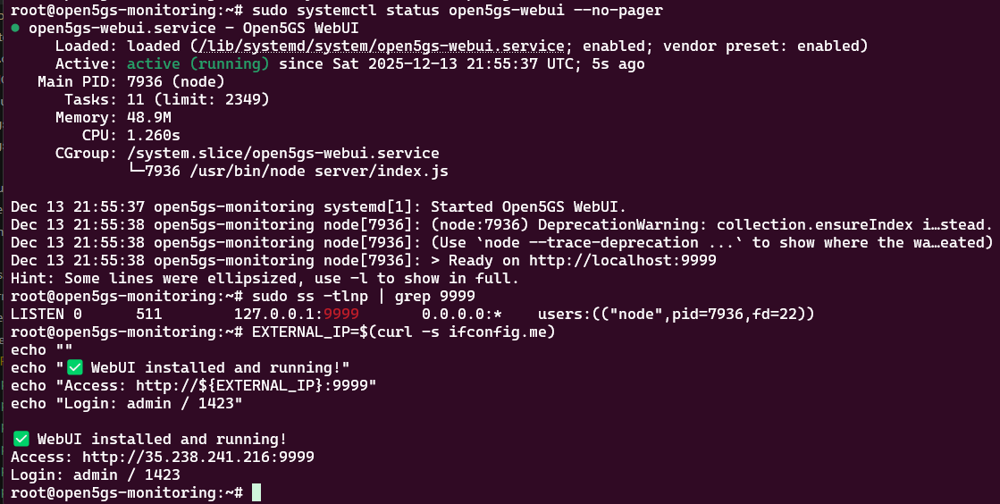

## 👤 STEP 8: Register Test Subscribers (15 minutes)

### 8.1 Access WebUI

**Important:** Open the browser on **your local machine** (laptop/desktop), NOT inside any VM.

**If you get "connection refused" error, it's because WebUI binds to localhost only. Fix with port forwarding:**

```bash
# SSH into Monitoring VM
gcloud compute ssh open5gs-monitoring --zone=$ZONE

# Check if WebUI service is running
sudo systemctl status open5gs-webui

# If not running, check the logs
sudo journalctl -u open5gs-webui -n 50

# Verify WebUI is listening on 127.0.0.1:9999
sudo ss -tlnp | grep 9999

# Install socat for port forwarding
sudo apt update
sudo apt install -y socat

# Stop the WebUI service temporarily
sudo systemctl stop open5gs-webui

# Create startup script that runs WebUI + port forwarder
sudo tee /usr/local/bin/open5gs-webui-with-forwarder.sh > /dev/null << 'EOF'
#!/bin/bash

# Start WebUI on localhost
cd /usr/lib/node_modules/open5gs
/usr/bin/node server/index.js &
WEBUI_PID=$!

# Wait for WebUI to start
sleep 3

# Forward external port 9998 -> localhost:9999
socat TCP-LISTEN:9998,fork,reuseaddr TCP:127.0.0.1:9999 &
SOCAT_PID=$!

# Wait for both processes
wait $WEBUI_PID $SOCAT_PID
EOF

sudo chmod +x /usr/local/bin/open5gs-webui-with-forwarder.sh

# Update systemd service to use the forwarder script
sudo tee /lib/systemd/system/open5gs-webui.service > /dev/null << 'EOF'
[Unit]
Description=Open5GS WebUI with Port Forwarder
Wants=mongodb.service mongod.service

[Service]
Type=simple
WorkingDirectory=/usr/lib/node_modules/open5gs
Environment=NODE_ENV=production
ExecStart=/usr/local/bin/open5gs-webui-with-forwarder.sh
Restart=always
RestartSec=2

[Install]
WantedBy=multi-user.target
EOF

# Reload systemd and start service
sudo systemctl daemon-reload
sudo systemctl start open5gs-webui

# Wait for services to start
sleep 5

# Verify both ports are listening
echo "=== Port Check ==="
sudo ss -tlnp | grep -E "9999|9998"
echo ""
echo "✅ WebUI (internal): 127.0.0.1:9999"
echo "✅ Forwarder (external): 0.0.0.0:9998"

# Exit Monitoring VM
exit
```

**Update GCP firewall rule to use port 9998:**

```bash
# Run from your local machine
export ZONE="us-central1-a"

# Delete old firewall rule
gcloud compute firewall-rules delete open5gs-allow-webui --quiet

# Create new firewall rule for port 9998
gcloud compute firewall-rules create open5gs-allow-webui \
  --network=open5gs-vpc \
  --allow=tcp:9998 \
  --source-ranges=0.0.0.0/0 \
  --description="Allow Open5GS WebUI access on port 9998"
```

**Access WebUI from your local machine's browser:**

1. Get Monitoring VM external IP: `gcloud compute instances describe open5gs-monitoring --zone=$ZONE --format="get(networkInterfaces[0].accessConfigs[0].natIP)"`
2. Open browser on **your local machine**: `http://<MONITORING_EXTERNAL_IP>:9998` (note port **9998**)
3. Login: `admin` / `1423`

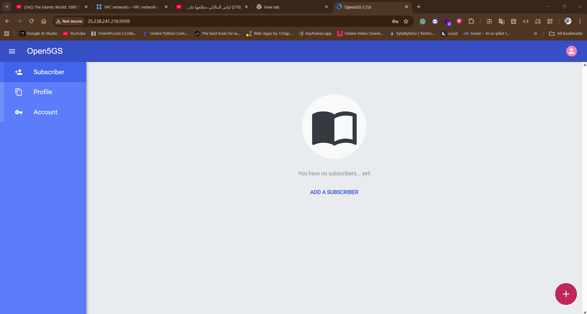

### 8.2 Add Test Subscribers

Click "Subscriber" → "+ Add" and enter the first subscriber:

```
IMSI: 999700000000001
K: 465B5CE8B199B49FAA5F0A2EE238A6BC
OPc: E8ED289DEBA952E4283B54E88E6183CA
AMF: 8000
APN/DNN: internet
SST: 1
```

Click "SAVE"

**Add a second subscriber for UERANSIM testing:**

Click "Subscriber" → "+ Add" and enter:

```
IMSI: 999700000000002
K: 465B5CE8B199B49FAA5F0A2EE238A6BC
OPc: E8ED289DEBA952E4283B54E88E6183CA
AMF: 8000
APN/DNN: internet
SST: 1
```

Click "SAVE"

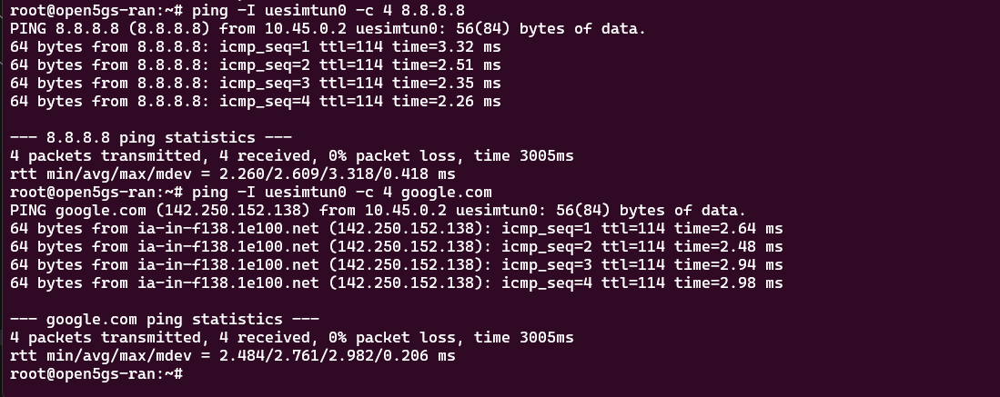

### 8.3 Verify Subscriber Data in MongoDB (IMPORTANT)

**After adding subscribers via WebUI, verify they have correct access settings:**

```bash
# SSH to database VM
gcloud compute ssh open5gs-db --zone=$ZONE --tunnel-through-iap

# Check subscriber data
mongosh open5gs --quiet --eval "db.subscribers.find({imsi: '999700000000002'}, {imsi: 1, access_restriction_data: 1, subscriber_status: 1, network_access_mode: 1}).pretty()"
```

**Expected output:**

```javascript
{
  imsi: '999700000000002',
  access_restriction_data: 32,  // THIS BLOCKS 5G - needs to be 0
  subscriber_status: 0,
  network_access_mode: 0
}
```

**CRITICAL FIX:** If `access_restriction_data` is 32, update it to 0:

```bash
# Fix access restrictions for 5G
mongosh open5gs --quiet --eval "db.subscribers.updateOne({imsi: '999700000000002'}, {\$set: {access_restriction_data: 0}})"

# Verify the fix
mongosh open5gs --quiet --eval "db.subscribers.find({imsi: '999700000000002'}, {imsi: 1, access_restriction_data: 1}).pretty()"

# Exit database VM
exit
```

**Expected after fix:**

```javascript
{
  imsi: '999700000000002',
  access_restriction_data: 0  // ✅ Now allows 5G services
}
```

---

## ✅ STEP 9: Validation & Health Check (15 minutes)

### 9.1 Quick Validation Script

Run on your local machine:

```bash
# Set variables
ZONE="us-central1-a"

echo "=== Open5GS 5G Core Validation ==="

# Check services on Control Plane
gcloud compute ssh open5gs-control --zone=$ZONE --tunnel-through-iap --command="
  echo 'Control Plane Services:'
  for svc in smfd nrfd amfd udmd udrd pcfd ausfd nssfd bsfd; do
    status=\$(systemctl is-active open5gs-\$svc 2>/dev/null)
    echo \"  open5gs-\$svc: \$status\"
  done
  echo ''
  echo 'Key Ports:'
  ss -tlnp | grep -E '38412|7777' | head -5
  echo ''
  echo 'SMF-UPF Association Check:'
  sudo journalctl -u open5gs-smfd -n 20 --no-pager | grep -E 'PFCP associated|10.11.0.7'
"

# Check services on User Plane
gcloud compute ssh open5gs-userplane --zone=$ZONE --tunnel-through-iap --command="
  echo 'User Plane Services:'
  systemctl is-active open5gs-upfd
  echo ''
  echo 'UPF Ports:'
  sudo ss -ulnp | grep -E '8805|2152'
"

# Get WebUI URL
WEBUI_IP=$(gcloud compute instances describe open5gs-monitoring --zone=$ZONE --format="get(networkInterfaces[0].accessConfigs[0].natIP)")
echo ""
echo "WebUI: http://${WEBUI_IP}:9998 | Login: admin / 1423"
```

### 9.2 Expected Results

```
✅ All 5G core services show "active"
✅ Port 38412 (AMF NGAP) listening
✅ Port 8805 (UPF PFCP) listening on 10.11.0.7
✅ Port 2152 (GTP-U) listening on 10.11.0.7
✅ SMF shows "PFCP associated [10.11.0.7]:8805"
✅ WebUI accessible
```

---

## 📋 Quick Configuration Reference

### Critical Configuration Files

**Control VM (10.10.0.2) - /etc/open5gs/**

**udr.yaml:**

```yaml
db_uri: mongodb://10.10.0.4/open5gs # NOT 127.0.0.1
```

**pcf.yaml:**

```yaml
db_uri: mongodb://10.10.0.4/open5gs # NOT localhost
```

**smf.yaml:**

```yaml
smf:
  sbi:
    server:
      - address: 127.0.0.4 # ⚠️ MUST be localhost
        port: 7777
  pfcp:
    server:
      - address: 10.10.0.2 # ⚠️ MUST be real IP
  gtpc:
    server:
      - address: 10.10.0.2
  gtpu:
    server:
      - address: 10.10.0.2
```

**amf.yaml:**

```yaml
amf:
  ngap:
    server:
      - address: 10.10.0.2 # NOT 127.0.0.5
```

**User Plane VM (10.11.0.7) - /etc/open5gs/**

**upf.yaml:**

```yaml
upf:
  pfcp:
    server:
      - address: 10.11.0.7 # NOT 127.0.0.7
  gtpu:
    server:
      - address: 10.11.0.7
```

### Services to Disable (Port Conflicts)

**Control VM:**

```bash
sudo systemctl stop open5gs-mmed open5gs-hssd open5gs-pcrfd open5gs-sgwcd
sudo systemctl disable open5gs-mmed open5gs-hssd open5gs-pcrfd open5gs-sgwcd
```

**User Plane VM:**

```bash
sudo systemctl stop open5gs-sgwud open5gs-sgwcd open5gs-smfd
sudo systemctl disable open5gs-sgwud open5gs-sgwcd open5gs-smfd
```

### MongoDB Subscriber Fix

**Database VM (10.10.0.4):**

```bash
mongosh open5gs --quiet --eval "db.subscribers.updateMany({}, {\$set: {access_restriction_data: 0}})"
```

### Port Verification Commands

**Control VM:**

```bash
sudo ss -tlnp | grep 38412    # AMF NGAP
sudo ss -ulnp | grep 2123     # SMF GTPC
```

**User Plane VM:**

```bash
sudo ss -ulnp | grep 8805     # UPF PFCP (must NOT be SGW-U)
sudo ss -ulnp | grep 2152     # UPF GTPU
```

**Expected UPF port 8805:**

```
UNCONN 0 0 10.11.0.7:8805 0.0.0.0:* users:(("open5gs-upfd",pid=XXX,fd=7))
```

⚠️ If you see "open5gs-sgwud" instead, UPF is NOT running!

### Service Status Check

**All 5G services:**

```bash
# Control VM
for svc in smfd nrfd amfd udmd udrd pcfd ausfd nssfd bsfd; do
  echo -n "open5gs-$svc: "
  systemctl is-active open5gs-$svc
done

# User Plane VM
systemctl is-active open5gs-upfd
```

**Expected:** All show `active`

### SMF-UPF Association Verification

```bash
# On Control VM
sudo journalctl -u open5gs-smfd -n 20 --no-pager | grep 'PFCP associated'
```

**Expected output:**

```
[smf] INFO: PFCP associated [10.11.0.7]:8805
```

### Service Restart Order (If Needed)

```bash
# Control VM - Start in this order:
sudo systemctl restart open5gs-nrfd      # 1. NRF first
sleep 3
sudo systemctl restart open5gs-smfd      # 2. SMF
sudo systemctl restart open5gs-amfd      # 3. AMF
sudo systemctl restart open5gs-udmd open5gs-udrd open5gs-pcfd open5gs-ausfd open5gs-nssfd open5gs-bsfd

# User Plane VM:
sudo systemctl restart open5gs-upfd
```

### Common Error Messages & Quick Fixes

| Error Message                                      | Fix                                       |
| -------------------------------------------------- | ----------------------------------------- |
| `Cannot find IMSI in DB`                           | Fix UDR db_uri to 10.10.0.4               |
| `mongoc_collection_find_with_opts, cannot be NULL` | Fix PCF db_uri to 10.10.0.4               |
| `socket bind(2) [10.10.0.2]:7777 failed`           | SMF SBI must be 127.0.0.4                 |
| `socket bind(2) [10.11.0.7]:8805 failed`           | Stop SGW-U on User Plane VM               |
| `ogs_sendto(... 10.11.0.7:8805) failed`            | Check SMF PFCP address and UPF status     |
| `FIVEG_SERVICES_NOT_ALLOWED`                       | Set access_restriction_data: 0 in MongoDB |
| `socket bind(2) [10.10.0.2]:2123 failed`           | Stop MME/SGW-C on Control VM              |

### UERANSIM Quick Test Commands

**Terminal 1 (gNB):**

```bash
cd ~/UERANSIM
sudo ./build/nr-gnb -c config/open5gs-gnb.yaml
```

**Terminal 2 (UE):**

```bash
cd ~/UERANSIM
sudo ./build/nr-ue -c config/open5gs-ue.yaml
```

**Terminal 3 (Test):**

```bash
ip addr show uesimtun0                  # Should have 10.45.0.x IP
sudo ping -I uesimtun0 -c 4 8.8.8.8     # Should get replies
sudo ping -I uesimtun0 -c 4 google.com  # DNS should work
```

### Emergency Recovery Commands

**Reset all services:**

```bash
# Control VM
sudo systemctl restart open5gs-*

# User Plane VM
sudo systemctl restart open5gs-upfd
```

**Check all logs at once:**

```bash
# Control VM
sudo journalctl -u open5gs-amfd -u open5gs-smfd -u open5gs-pcfd -u open5gs-udrd --since "5 minutes ago" --no-pager
```

### IP Address Reference

| VM         | Internal IP | External IP | Purpose               |
| ---------- | ----------- | ----------- | --------------------- |
| Database   | 10.10.0.4   | None        | MongoDB 8.0           |
| Control    | 10.10.0.2   | Yes         | 5G Core Control Plane |
| User Plane | 10.11.0.7   | None        | UPF (data forwarding) |
| Monitoring | 10.10.0.50  | Yes         | WebUI on port 9998    |
| RAN        | 10.10.0.100 | None        | UERANSIM (gNB + UE)   |

### Key Ports Reference

| Port  | Service  | IP        | Protocol |
| ----- | -------- | --------- | -------- |
| 27017 | MongoDB  | 10.10.0.4 | TCP      |
| 38412 | AMF NGAP | 10.10.0.2 | SCTP     |
| 8805  | UPF PFCP | 10.11.0.7 | UDP      |
| 2152  | UPF GTPU | 10.11.0.7 | UDP      |
| 2123  | SMF GTPC | 10.10.0.2 | UDP      |
| 9998  | WebUI    | 0.0.0.0   | TCP      |

---

## 🔧 Troubleshooting Guide - All Critical Fixes

> **Note:** All these fixes are already integrated into the deployment steps above. This section documents common issues and their solutions for reference.

### Fix #1: UDR MongoDB Connection

**Symptoms:**

- Error: `[dbi] ERROR: [imsi-999700000000002] Cannot find IMSI in DB`
- Subscriber authentication fails
- UDR cannot access remote MongoDB

**Root Cause:** UDR configured to use localhost MongoDB instead of remote Database VM (10.10.0.4)

**Solution:**

```bash
# On Control VM
sudo sed -i 's|mongodb://127.0.0.1/open5gs|mongodb://10.10.0.4/open5gs|g' /etc/open5gs/udr.yaml
sudo systemctl restart open5gs-udrd

# Verify
sudo grep 'db_uri' /etc/open5gs/udr.yaml
# Expected: db_uri: mongodb://10.10.0.4/open5gs
```

---

### Fix #2: PCF MongoDB Connection

**Symptoms:**

- Error: `mongoc_collection_find_with_opts, cannot be NULL`
- AMF receives HTTP 500 errors
- UE registration rejected
- PCF crashes repeatedly

**Root Cause:** PCF accessing localhost instead of remote MongoDB

**Solution:**

```bash
# On Control VM
sudo sed -i 's|db_uri: mongodb://localhost/open5gs|db_uri: mongodb://10.10.0.4/open5gs|g' /etc/open5gs/pcf.yaml
sudo systemctl restart open5gs-pcfd

# Verify
sudo grep 'db_uri' /etc/open5gs/pcf.yaml
# Expected: db_uri: mongodb://10.10.0.4/open5gs
```

---

### Fix #3: SMF Network Binding

**Symptoms:**

- Error: `socket bind(2) [10.10.0.2]:7777 failed (98:Address already in use)`
- SMF crashes on startup
- Cannot communicate with UPF

**Root Cause:** SMF trying to bind SBI service to external IP 10.10.0.2 on port 7777, which is already in use

**Solution:** Keep SBI on localhost (127.0.0.4), only PFCP/GTP use real IP (10.10.0.2)

```yaml
# /etc/open5gs/smf.yaml - Critical distinction
smf:
  sbi:
    server:
      - address: 127.0.0.4 # ⚠️ MUST be localhost for SBI
        port: 7777
  pfcp:
    server:
      - address: 10.10.0.2 # ⚠️ MUST be real IP for PFCP
  gtpc:
    server:
      - address: 10.10.0.2 # Real IP for GTP-C
  gtpu:
    server:
      - address: 10.10.0.2 # Real IP for GTP-U
```

```bash
# Restart after editing
sudo systemctl restart open5gs-smfd

# Verify PFCP association
sudo journalctl -u open5gs-smfd -n 10 | grep 'PFCP associated'
# Expected: [smf] INFO: PFCP associated [10.11.0.7]:8805
```

---

### Fix #4: Port 8805 Conflict (SGW-U vs UPF)

**Symptoms:**

- Error: `socket bind(2) [10.11.0.7]:8805 failed (98:Address already in use)`
- UPF crashes in restart loop
- SMF cannot establish PFCP association
- `ss -ulnp | grep 8805` shows "open5gs-sgwud" instead of "open5gs-upfd"

**Root Cause:** 4G SGW-U service occupying port 8805 that 5G UPF needs

**Solution:**

```bash
# On User Plane VM - Disable ALL 4G services
sudo systemctl stop open5gs-sgwud open5gs-sgwcd open5gs-smfd
sudo systemctl disable open5gs-sgwud open5gs-sgwcd open5gs-smfd

# Start UPF
sudo systemctl start open5gs-upfd

# Verify correct service on port 8805
sudo ss -ulnp | grep 8805
# Expected: UNCONN ... 10.11.0.7:8805 ... users:(("open5gs-upfd",pid=XXX,fd=7))
```

---

### Fix #5: Port 2123 Conflict (4G vs 5G)

**Symptoms:**

- Error: `socket bind(2) [10.10.0.2]:2123 failed (98:Address already in use)`
- SMF cannot start
- Port conflict with MME/SGW-C

**Root Cause:** 4G services (MME, SGW-C, PCRF) blocking ports needed by 5G SMF

**Solution:**

```bash
# On Control VM - Disable ALL 4G services
sudo systemctl stop open5gs-mmed open5gs-hssd open5gs-pcrfd open5gs-sgwcd
sudo systemctl disable open5gs-mmed open5gs-hssd open5gs-pcrfd open5gs-sgwcd

# Restart 5G services
sudo systemctl restart open5gs-smfd open5gs-nrfd open5gs-amfd

# Verify SMF is using port 2123
sudo ss -ulnp | grep 2123
# Expected: Only SMF on 10.10.0.2:2123
```

---

### Fix #6: Subscriber Access Restrictions

**Symptoms:**

- Error: `[nas] [error] Initial Registration failed [FIVEG_SERVICES_NOT_ALLOWED]`
- UE authentication succeeds but registration rejected with cause code 7
- Subscriber exists in database but 5G access blocked

**Root Cause:** MongoDB subscribers have `access_restriction_data: 32` which blocks 5G services

**Solution:**

```bash
# On Database VM
mongosh open5gs --quiet --eval "db.subscribers.updateMany({}, {\$set: {access_restriction_data: 0}})"

# Verify
mongosh open5gs --quiet --eval "db.subscribers.find({}, {imsi: 1, access_restriction_data: 1}).pretty()"
# Expected: access_restriction_data: 0 for all subscribers
```

---

### Service Architecture Reference

**What Should Run Where:**

**Control VM (10.10.0.2) - 5G Only:**

- ✅ open5gs-nrfd, smfd, amfd, udmd, udrd, pcfd, ausfd, nssfd, bsfd
- ❌ NO: mmed, hssd, pcrfd, sgwcd (4G - cause port conflicts)

**User Plane VM (10.11.0.7) - 5G Only:**

- ✅ open5gs-upfd (5G UPF only)
- ❌ NO: sgwud, sgwcd, smfd (4G or misplaced services)

**Key Principle:** Cannot run 4G and 5G services simultaneously - they share critical ports (2123, 8805, etc.)

---

## 🎯 What's Next?

**Phase 1 Complete!** ✅

You now have a fully functional 5G SA Core network on GCP VMs.

### Choose Your Path:

**Option 1: Skip to Monitoring & Performance Testing** ⭐ POPULAR

- Complete the BONUS section below to install UERANSIM
- **Skip Phase 2 entirely** and jump directly to [PHASE-3-VM-Monitoring.md](PHASE-3-VM-Monitoring.md)
- Get Prometheus/Grafana dashboards, network slicing, benchmarks
- **Phase 2 is NOT required for Phase 3!**

**Option 2: Add DevOps Automation** (Learn CI/CD)

- Go to [PHASE-2-VM-DevOps.md](PHASE-2-VM-DevOps.md) for Git, CI/CD, automated testing
- Then optionally continue to Phase 3 afterwards
- Phase 2 is completely independent

**Option 3: You're done!**

- Your 5G network is working - you can stop here for basic academic projects

---

## 📱 BONUS: Quick UERANSIM Test (30 minutes)

> **⚠️ REQUIRED for Phase 3!** If you plan to do Phase 3 (Monitoring), complete this section first.
>
> **For academic demos:** This section lets you test UE connectivity and is needed for benchmarking.

### Install UERANSIM on RAN VM

```bash
# SSH into RAN VM (use IAP tunneling from local machine)
gcloud compute ssh open5gs-ran --zone=$ZONE --tunnel-through-iap

# Install dependencies
sudo apt update
sudo apt install -y make gcc g++ libsctp-dev lksctp-tools iproute2 cmake

# Clone and build UERANSIM
cd ~
git clone https://github.com/aligungr/UERANSIM
cd UERANSIM
make
```

### Configure gNB (5G Base Station)

```bash
cat > config/open5gs-gnb.yaml << 'EOF'
mcc: '999'
mnc: '70'
nci: '0x000000010'
idLength: 32
tac: 1

linkIp: 10.10.0.100
ngapIp: 10.10.0.100
gtpIp: 10.10.0.100

amfConfigs:
  - address: 10.10.0.2
    port: 38412

slices:
  - sst: 1

ignoreStreamIds: true
EOF
```

### Configure UE (User Equipment)

**Important:** This UE uses IMSI `999700000000002` - make sure you registered this subscriber in the WebUI (Step 8.2).

```bash
cat > config/open5gs-ue.yaml << 'EOF'
supi: 'imsi-999700000000002'
mcc: '999'
mnc: '70'
key: '465B5CE8B199B49FAA5F0A2EE238A6BC'
op: 'E8ED289DEBA952E4283B54E88E6183CA'
opType: 'OPC'
amf: '8000'

gnbSearchList:
  - 10.10.0.100

uacAic:
  mps: false
  mcs: false

uacAcc:
  normalClass: 0
  class11: false
  class12: false
  class13: false
  class14: false
  class15: false

sessions:
  - type: 'IPv4'
    apn: 'internet'
    slice:
      sst: 1

configured-nssai:
  - sst: 1

default-nssai:
  - sst: 1

integrity:
  IA1: false
  IA2: true
  IA3: false

ciphering:
  EA1: false
  EA2: true
  EA3: false

integrityMaxRate:
  uplink: 'full'
  downlink: 'full'
EOF
```

### Run Test

**Open 3 terminal sessions to the RAN VM:**

**Terminal 1: Start gNB**

```bash
# SSH into RAN VM
gcloud compute ssh open5gs-ran --zone=$ZONE --tunnel-through-iap

# Navigate to UERANSIM directory
cd ~/UERANSIM

# Start gNB
./build/nr-gnb -c config/open5gs-gnb.yaml
```

**Expected output:** `[GNB] NG Setup procedure is successful`

**Terminal 2: Start UE**

```bash
# SSH into RAN VM (new session)
gcloud compute ssh open5gs-ran --zone=$ZONE --tunnel-through-iap

# Navigate to UERANSIM directory
cd ~/UERANSIM

# Start UE (requires sudo for TUN interface)
sudo ./build/nr-ue -c config/open5gs-ue.yaml
```

**Expected output:** `[UE] Registration successful` and `[UE] PDU Session establishment successful`

**Terminal 3: Test Internet Connectivity**

```bash
# SSH into RAN VM (new session)
gcloud compute ssh open5gs-ran --zone=$ZONE --tunnel-through-iap

# Wait a few seconds for UE to register, then test connectivity
sudo ping -I uesimtun0 8.8.8.8

# Test DNS resolution
sudo ping -I uesimtun0 google.com
```

**Expected output:** Ping replies from 8.8.8.8! 🎉


---

## 🔧 TROUBLESHOOTING GUIDE - Common Issues & Fixes

### Issue 1: UE Registration Fails with "FIVEG_SERVICES_NOT_ALLOWED"

**Symptom:** UE authentication succeeds but registration rejected with cause code 7

**Root Cause:** MongoDB subscriber has `access_restriction_data: 32` which blocks 5G services

**Fix:**

```bash
gcloud compute ssh open5gs-db --zone=$ZONE --tunnel-through-iap

# Update subscriber access restrictions
mongosh open5gs --quiet --eval "db.subscribers.updateOne({imsi: '999700000000002'}, {\$set: {access_restriction_data: 0}})"

# Verify fix
mongosh open5gs --quiet --eval "db.subscribers.find({imsi: '999700000000002'}, {access_restriction_data: 1}).pretty()"

exit
```

### Issue 2: SMF Cannot Reach UPF (PFCP Error)

**Symptom:** SMF logs show `[pfcp] ERROR: ogs_sendto(... 10.11.0.7:8805) failed (22:Invalid argument)`

**Root Cause:** SMF's PFCP/GTP addresses misconfigured, or port 8805 conflict with SGW-U

**Fix on Control VM:**

```bash
# Check if SMF is configured correctly
sudo grep -A 15 'pfcp:' /etc/open5gs/smf.yaml | head -20

# SMF should have:
# - SBI server on 127.0.0.4
# - PFCP/GTPC/GTPU on 10.10.0.2

# If wrong, fix with:
sudo sed -i '/^smf:/,/^  sbi:/{:a;n;/^    server:/,/^      - address:/{s/address: 10.10.0.2/address: 127.0.0.4/;ba}}' /etc/open5gs/smf.yaml
sudo systemctl restart open5gs-smfd
```

**Fix on User Plane VM:**

```bash
# Check if SGW-U is blocking port 8805
sudo ss -ulnp | grep 8805

# If SGW-U is running, stop it:
sudo systemctl stop open5gs-sgwud
sudo systemctl disable open5gs-sgwud

# Restart UPF
sudo systemctl restart open5gs-upfd
sudo systemctl status open5gs-upfd
```

### Issue 3: PCF Returns HTTP 500 Error

**Symptom:** AMF logs show `[amf] ERROR: [imsi-xxx] HTTP response error [500]`

**Root Cause:** PCF trying to access local MongoDB instead of remote database

**Fix:**

```bash
gcloud compute ssh open5gs-control --zone=$ZONE --tunnel-through-iap

# Check PCF database URI
sudo grep 'db_uri' /etc/open5gs/pcf.yaml

# Should be: db_uri: mongodb://10.10.0.4/open5gs
# If localhost, fix it:
sudo sed -i 's|db_uri: mongodb://localhost/open5gs|db_uri: mongodb://10.10.0.4/open5gs|g' /etc/open5gs/pcf.yaml
sudo systemctl restart open5gs-pcfd
sudo systemctl status open5gs-pcfd
```

### Issue 4: UDR Cannot Find Subscriber in Database

**Symptom:** UDR logs show `[dbi] ERROR: [imsi-xxx] Cannot find IMSI in DB`

**Root Cause:** UDR pointing to localhost instead of remote MongoDB

**Fix:**

```bash
gcloud compute ssh open5gs-control --zone=$ZONE --tunnel-through-iap

# Check UDR database URI
sudo grep 'db_uri' /etc/open5gs/udr.yaml

# Should be: mongodb://10.10.0.4/open5gs
# If localhost, fix it:
sudo sed -i 's|mongodb://127.0.0.1/open5gs|mongodb://10.10.0.4/open5gs|g' /etc/open5gs/udr.yaml
sudo systemctl restart open5gs-udrd
sudo systemctl status open5gs-udrd
```

### Issue 5: gNB Cannot Connect to AMF

**Symptom:** UERANSIM shows `[SCTP] Connection refused` or `NG Setup failed`

**Root Cause:** AMF not listening on correct IP or firewall blocking SCTP

**Fix:**

```bash
# Verify AMF is listening
gcloud compute ssh open5gs-control --zone=$ZONE --tunnel-through-iap
sudo ss -tlnp | grep 38412

# Should show: LISTEN on 10.10.0.2:38412
# If not, check AMF config:
sudo grep -A 5 'ngap:' /etc/open5gs/amf.yaml

# Verify firewall allows SCTP
gcloud compute firewall-rules describe open5gs-allow-internal
```

### Issue 6: UPF Continuously Crashing

**Symptom:** `sudo systemctl status open5gs-upfd` shows restart loop

**Root Cause:** Port 8805 already in use by SGW-U (4G service)

**Fix:**

```bash
gcloud compute ssh open5gs-userplane --zone=$ZONE --tunnel-through-iap

# Check what's using port 8805
sudo ss -ulnp | grep 8805

# If SGW-U is present, stop it:
sudo systemctl stop open5gs-sgwud open5gs-sgwcd open5gs-smfd
sudo systemctl disable open5gs-sgwud open5gs-sgwcd open5gs-smfd

# Restart UPF
sudo systemctl start open5gs-upfd
sudo systemctl status open5gs-upfd
```

### Issue 7: Port Conflicts Between 4G and 5G Services

**Symptom:** Services fail to start with "Address already in use" errors

**Root Cause:** 4G services (MME, SGW-C, PCRF, HSS) conflicting with 5G services

**Fix - Disable All 4G Services:**

```bash
gcloud compute ssh open5gs-control --zone=$ZONE --tunnel-through-iap

# Stop and disable 4G services
sudo systemctl stop open5gs-mmed open5gs-hssd open5gs-pcrfd open5gs-sgwcd
sudo systemctl disable open5gs-mmed open5gs-hssd open5gs-pcrfd open5gs-sgwcd

# Restart 5G services
sudo systemctl restart open5gs-nrfd open5gs-smfd open5gs-amfd open5gs-udmd open5gs-udrd open5gs-pcfd open5gs-ausfd open5gs-nssfd open5gs-bsfd
```

### Quick Health Check Commands

```bash
# Control VM - Check all 5G services
gcloud compute ssh open5gs-control --zone=$ZONE --tunnel-through-iap --command "
  for svc in smfd nrfd amfd udmd udrd pcfd ausfd nssfd bsfd; do
    echo -n \"open5gs-\$svc: \"
    systemctl is-active open5gs-\$svc
  done
"

# User Plane VM - Check UPF and port
gcloud compute ssh open5gs-userplane --zone=$ZONE --tunnel-through-iap --command "
  systemctl is-active open5gs-upfd
  sudo ss -ulnp | grep 8805
"

# Verify SMF-UPF association
gcloud compute ssh open5gs-control --zone=$ZONE --tunnel-through-iap --command "
  sudo journalctl -u open5gs-smfd -n 20 --no-pager | grep 'PFCP associated'
"
```

---

## ✅ SUCCESS CHECKLIST

Before proceeding to testing, verify:

- [ ] All 5G services active on Control VM (smfd, nrfd, amfd, udmd, udrd, pcfd, ausfd, nssfd, bsfd)
- [ ] UPF active on User Plane VM
- [ ] SMF logs show "PFCP associated [10.11.0.7]:8805"
- [ ] Port 38412 listening on Control VM (AMF)
- [ ] Port 8805 listening on User Plane VM (UPF)
- [ ] MongoDB accessible from Control VM
- [ ] WebUI accessible at http://<EXTERNAL_IP>:9998
- [ ] Subscribers added with access_restriction_data: 0
- [ ] 4G services disabled (mmed, hssd, pcrfd, sgwcd, sgwud)

---

**Troubleshooting:**

If ping fails, check:

```bash
# Verify uesimtun0 interface exists
ip addr show uesimtun0

# Check UPF logs on User Plane VM
gcloud compute ssh open5gs-userplane --zone=$ZONE --tunnel-through-iap
sudo journalctl -u open5gs-upfd -f

# Check AMF logs on Control Plane VM
gcloud compute ssh open5gs-control --zone=$ZONE --tunnel-through-iap
sudo journalctl -u open5gs-amfd -f
```

---

## 🎉 Phase 1 + BONUS Complete!

**Congratulations!** You now have:

- ✅ Full 5G SA Core network operational
- ✅ UERANSIM RAN simulator working
- ✅ Real internet connectivity through 5G network (0% packet loss!)

### Next Steps (Both Optional):

**📊 For Monitoring & Performance Testing:**

- Go to [PHASE-3-VM-Monitoring.md](PHASE-3-VM-Monitoring.md)
- Adds: Prometheus, Grafana, network slicing, benchmarks

**🔧 For DevOps & Automation:**

- Go to [PHASE-2-VM-DevOps.md](PHASE-2-VM-DevOps.md)
- Adds: Git version control, CI/CD, automated health checks
- **Note:** Phase 2 is independent - you can skip it and go straight to Phase 3

**🎓 For Academic Projects:**

- You're done! You have a working 5G network for demonstration purposes

---

**Time Spent:** 5-6 hours | **Status:** Complete ✅
